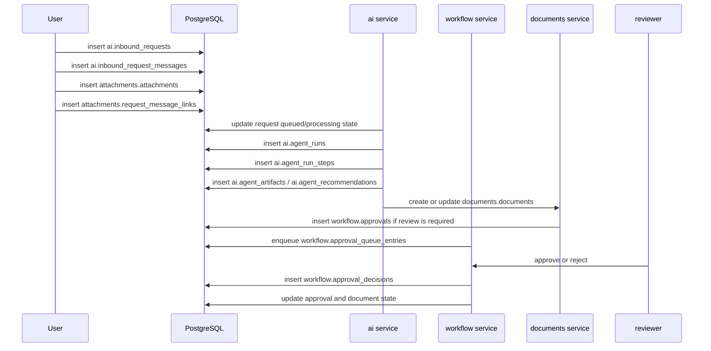
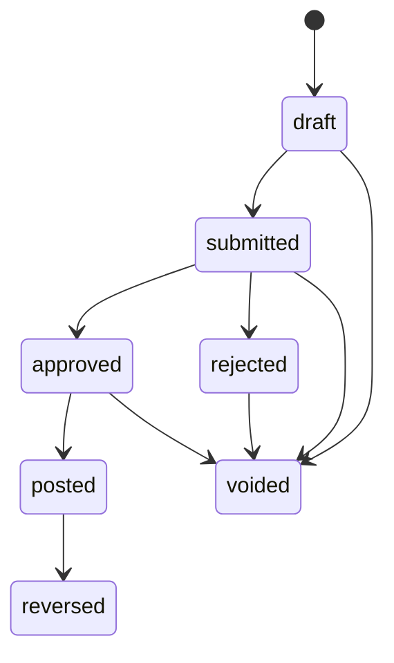
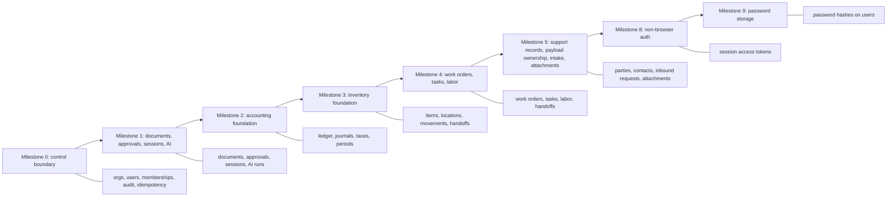

# Data Modeling And Database Schema

Date: 2026-03-31
Status: Active technical guide
Purpose: explain how `workflow_app` models durable truth in PostgreSQL, what the schema conventions are, and how database-level constraints support workflow correctness.

## 1. What the database is for

The database is the durable system of record.

`workflow_app` is not a memory-first app with a database on the side. It is designed so the important workflow state can be reconstructed from PostgreSQL alone.

That means the schema is part of the application architecture, not just storage plumbing.

## 2. High-level schema layout

The repository uses schema-per-domain organization.

Current schemas include:

1. `identityaccess`
2. `workflow`
3. `documents`
4. `accounting`
5. `inventory_ops`
6. `workforce`
7. `work_orders`
8. `attachments`
9. `ai`
10. `platform`
11. `parties`

That layout makes ownership clearer and reduces accidental cross-module writes.

## 3. Core modeling rules

The schema follows a small set of durable rules:

1. every meaningful business row has one owning module
2. every tenant-scoped table carries `org_id`
3. cross-module joins use explicit foreign keys
4. append-only truth is enforced at the database boundary where it matters
5. invalid lifecycle transitions are rejected by constraints or transaction logic
6. review data is derived from base truth, not used as the source of truth

Those rules are the difference between a stable workflow system and a pile of loosely joined tables.

## 4. Tenant scoping

Nearly every business table is scoped by organization.

The pattern is:

1. `org_id` appears on the table
2. foreign keys point to org-owned records
3. unique indexes are usually org-scoped
4. service queries always filter by the caller's org

Example:

```sql
CREATE TABLE identityaccess.memberships (
	org_id UUID NOT NULL REFERENCES identityaccess.orgs (id) ON DELETE RESTRICT,
	user_id UUID NOT NULL REFERENCES identityaccess.users (id) ON DELETE RESTRICT,
	role_code TEXT NOT NULL,
	status TEXT NOT NULL DEFAULT 'active'
);
```

That org scoping keeps one tenant from reaching another tenant's records even when IDs are globally unique.

## 5. Schema and table naming

The naming pattern is intentionally regular:

1. schema names match the domain or module owner
2. table names are plural nouns
3. join tables describe the relationship they represent
4. supporting records sit beside the module they support rather than in a generic shared bucket

Examples:

1. `documents.documents`
2. `workflow.approvals`
3. `ai.agent_runs`
4. `inventory_ops.movements`
5. `attachments.request_message_links`

The repository uses both `inventory_ops` and `work_orders` in planning language, while the Go packages are `internal/inventoryops` and `internal/workorders`.

## 6. Identifier strategy

The database uses UUID primary keys for durable records.

Some records also carry business-friendly numbering fields:

1. inbound requests have `REQ-...` references
2. journal entries have entry numbers
3. inventory movements have movement numbers
4. documents may have number values from numbering series

That split is intentional:

1. UUIDs are stable internal identifiers
2. numbered references are operator-facing continuity identifiers

## 7. Numbering series

Numbering is tracked in dedicated series tables rather than inferred from ad hoc counts.

Examples:

1. `documents.numbering_series`
2. `accounting.journal_numbering_series`
3. `inventory_ops.movement_numbering_series`
4. `ai.inbound_request_numbering_series`

That gives the app a durable, transaction-safe way to produce human-friendly numbers without depending on race-prone application memory.

Example from the inbound-request reference migration:

```sql
CREATE TABLE ai.inbound_request_numbering_series (
	org_id UUID PRIMARY KEY REFERENCES identityaccess.orgs (id) ON DELETE CASCADE,
	next_number BIGINT NOT NULL DEFAULT 1
);
```

## 8. Check constraints versus service validation

The schema deliberately uses check constraints for many invariants.

Examples include:

1. allowed status values
2. non-blank text fields
3. positive numeric values
4. valid enum-like role codes
5. lifecycle field consistency

That means a service bug is less likely to silently create invalid state.

Examples:

```sql
CONSTRAINT documents_documents_status_allowed CHECK (status IN ('draft', 'submitted', 'approved', 'rejected', 'posted', 'reversed', 'voided'))
```

```sql
CONSTRAINT accounting_journal_lines_one_sided_amount CHECK (
	(debit_minor > 0 AND credit_minor = 0)
	OR (credit_minor > 0 AND debit_minor = 0)
)
```

The rule of thumb is:

1. use the service layer for workflow intent
2. use constraints for hard safety boundaries

## 9. Unique indexes and partial uniqueness

The schema uses unique indexes to prevent duplicate truth.

Important examples:

1. one pending approval per document
2. one posting journal entry per source document
3. one reversal per reversed entry
4. one approval queue entry per approval
5. one message index per request
6. one request reference per org

Partial uniqueness is especially important where a record can have multiple states but only one active version at a time.

Example:

```sql
CREATE UNIQUE INDEX workflow_approvals_one_pending_per_document
	ON workflow.approvals (document_id)
	WHERE status = 'pending';
```

That is how the database helps enforce the workflow model instead of trusting handlers alone.

## 10. Composite foreign keys

Many tables use composite foreign keys of `(org_id, id)` or `(org_id, natural_key)` to keep tenant boundaries tight.

Examples:

1. `ai.inbound_request_messages` references `ai.inbound_requests` by `(org_id, request_id)`
2. `attachments.request_message_links` references both request messages and attachments by org-scoped keys
3. `accounting.invoice_documents` and `accounting.payment_receipt_documents` reference the shared document row and party records with org-aware foreign keys

This pattern matters because it prevents accidental cross-org linking even when an ID is copied into the wrong request.

## 11. Append-only and mutation control

Some tables are intended to be append-only once written.

Examples:

1. accounting journal entries and journal lines
2. inventory movements
3. AI run history records

The schema enforces that through triggers and deferred validation where needed.

Example:

```sql
CREATE TRIGGER accounting_journal_entries_no_update
BEFORE UPDATE OR DELETE ON accounting.journal_entries
FOR EACH ROW
EXECUTE FUNCTION accounting.prevent_journal_mutation();
```

That keeps posted truth from being rewritten in place.

## 12. Deferred balance enforcement

Accounting uses deferred constraint checks for journal balance.

That allows a transaction to insert all of its lines and then be validated at commit time rather than requiring the lines to be inserted in a special order.

The actual balance rule lives in the database because journal balance is a core financial invariant, not an optional service convention.

## 13. Document and workflow shape

The central business document model is the bridge between many modules.

The document row holds shared lifecycle truth:

1. draft
2. submitted
3. approved
4. rejected
5. posted
6. reversed
7. voided

Workflow approvals point to documents, and accounting posting also points back to documents.

That is the core pattern that lets `workflow_app` keep one shared document identity while still allowing domain-specific payload tables to exist beside it.

## 14. AI and inbound-request shape

The AI schema stores both the request intake and the execution history.

Important tables include:

1. `ai.inbound_requests`
2. `ai.inbound_request_messages`
3. `ai.agent_runs`
4. `ai.agent_run_steps`
5. `ai.agent_artifacts`
6. `ai.agent_recommendations`
7. `ai.agent_delegations`

This lets the application answer questions like:

1. what request was processed
2. what context the model saw
3. what tools it used
4. what artifact it produced
5. whether it delegated to a specialist

Example:

```sql
CREATE TABLE ai.agent_runs (
	org_id UUID NOT NULL REFERENCES identityaccess.orgs (id) ON DELETE RESTRICT,
	session_id UUID NOT NULL REFERENCES identityaccess.sessions (id) ON DELETE RESTRICT,
	actor_user_id UUID NOT NULL REFERENCES identityaccess.users (id) ON DELETE RESTRICT,
	agent_role TEXT NOT NULL,
	capability_code TEXT NOT NULL,
	status TEXT NOT NULL
);
```

## 15. Inventory and work-order shape

Inventory and work-order tables are modeled to preserve operational truth separately from financial posting truth.

Inventory tables capture:

1. items
2. locations
3. movements
4. execution links
5. accounting handoffs
6. derived stock

Work-order tables capture:

1. work order truth
2. status history
3. material usage links

This separation matters because a movement can be operationally real before it is financially posted.

## 16. Support records

The schema includes support-depth records such as:

1. `parties.parties`
2. `parties.contacts`
3. `workforce.workers`

These are deliberately narrower than a primary CRM model.

They exist to support workflow-specific documents and postings, not to become the center of gravity.

## 17. Reporting as derived truth

The `reporting` package is a read layer, but it depends on the database layout heavily.

That means the schema and the reporting layer evolve together.

If the base model changes, the read model may need to change even when no new business behavior is being added.

## 18. Practical change rules

When making schema changes:

1. update the owning module first
2. add or adjust the migration
3. verify the service code still matches the schema
4. update the reporting read models if continuity changed
5. add or update integration tests
6. update the technical guide if the data model changed in a durable way

Do not treat a migration as finished until the service and reporting paths are consistent with it.

## 19. Domain-by-domain map

This is the quickest way to build a mental model of the schema.

### 19.1 Identity and access

The `identityaccess` schema owns tenant and authentication truth:

1. `orgs`
2. `users`
3. `memberships`
4. `sessions`
5. `session_access_tokens`

This layer answers:

1. who belongs to which org
2. how a user authenticated
3. which session or token is currently valid

The later domains depend on these tables for every meaningful user-owned row.

### 19.2 Document and workflow core

The document layer is the shared lifecycle backbone:

1. `documents.document_types`
2. `documents.numbering_series`
3. `documents.documents`
4. `workflow.approvals`
5. `workflow.approval_queue_entries`
6. `workflow.approval_decisions`
7. `workflow.tasks`

`documents.documents` is the common business record that other modules point back to.

The workflow tables do not replace the document row. They describe state transitions around it.

### 19.3 AI intake and orchestration

The `ai` schema stores request intake and agent execution history:

1. `ai.inbound_requests`
2. `ai.inbound_request_messages`
3. `ai.agent_runs`
4. `ai.agent_run_steps`
5. `ai.agent_tools`
6. `ai.agent_tool_policies`
7. `ai.agent_artifacts`
8. `ai.agent_recommendations`
9. `ai.agent_delegations`
10. `ai.inbound_request_numbering_series`

This is the durable trace for what the system saw, what it did, and what it proposed.

### 19.4 Attachments and derived text

The `attachments` schema keeps binary artifacts and their derived text:

1. `attachments.attachments`
2. `attachments.request_message_links`
3. `attachments.derived_texts`

This lets the app retain originals, link them to intake messages, and store derived transcription text without overwriting the source.

### 19.5 Accounting

The accounting schema models both posting truth and document-specific payloads:

1. `accounting.ledger_accounts`
2. `accounting.journal_numbering_series`
3. `accounting.journal_entries`
4. `accounting.journal_lines`
5. `accounting.tax_codes`
6. `accounting.periods`
7. `accounting.invoice_documents`
8. `accounting.payment_receipt_documents`

The important distinction is:

1. `journal_entries` and `journal_lines` are immutable posted truth
2. `invoice_documents` and `payment_receipt_documents` are document payloads that describe the business event behind the posting

### 19.6 Inventory and work orders

Inventory and execution are separated on purpose:

1. `inventory_ops.items`
2. `inventory_ops.locations`
3. `inventory_ops.movement_numbering_series`
4. `inventory_ops.movements`
5. `inventory_ops.documents`
6. `inventory_ops.document_lines`
7. `inventory_ops.accounting_handoffs`
8. `inventory_ops.execution_links`
9. `work_orders.work_orders`
10. `work_orders.status_history`
11. `work_orders.material_usages`
12. `work_orders.documents`

The schema keeps operational stock truth, work-order execution truth, and financial handoff truth as distinct records.

### 19.7 Workforce and support records

The workforce and party schemas provide supporting operational entities:

1. `workforce.workers`
2. `workforce.labor_entries`
3. `workforce.labor_accounting_handoffs`
4. `parties.parties`
5. `parties.contacts`

These are narrower than a generic CRM or HR system. They exist to support workflow-linked records, not to become their own product surface.

## 20. The main relationship chains

If you want to understand the app end to end, follow these chains.

### 20.1 Intake to AI action

1. a request is stored in `ai.inbound_requests`
2. its messages are stored in `ai.inbound_request_messages`
3. attachments are linked through `attachments.request_message_links`
4. derived text is stored in `attachments.derived_texts`
5. a run is recorded in `ai.agent_runs`
6. step-by-step execution lands in `ai.agent_run_steps`
7. the model output becomes an artifact or recommendation
8. if the result creates a workflow candidate, it links to `workflow.approvals` or a downstream document

That chain is the database expression of the app's persist-first AI design.

### 20.2 Document to approval to posting

1. a document is created in `documents.documents`
2. if the document needs review, `workflow.approvals` gets a pending row
3. the item may appear in `workflow.approval_queue_entries`
4. a decision is recorded in `workflow.approval_decisions`
5. if approved, accounting or another domain consumes the document
6. posting creates a journal entry or another immutable business effect

That flow explains why the document row is separate from the posted accounting rows.

### 20.3 Inventory movement to accounting handoff

1. an inventory movement is recorded in `inventory_ops.movements`
2. the document-level representation may be stored in `inventory_ops.documents` and `inventory_ops.document_lines`
3. execution linkage may be stored in `inventory_ops.execution_links`
4. the financial consequence may be captured in `inventory_ops.accounting_handoffs`
5. the actual posting lands in `accounting.journal_entries`

The database keeps those as separate rows because they are related, but not identical, forms of truth.

### 20.4 Work order to material usage and labor

1. a work order is created in `work_orders.work_orders`
2. its lifecycle changes are appended to `work_orders.status_history`
3. inventory usage is linked through `work_orders.material_usages`
4. labor is captured in `workforce.labor_entries`
5. labor can be handed off through `workforce.labor_accounting_handoffs`

This separation makes it possible to inspect operational execution without collapsing everything into accounting postings.

## 21. Why the schema uses these specific patterns

The same few modeling ideas repeat across the codebase because they solve recurring control problems.

### 21.1 Org-scoped uniqueness

Most operator-facing codes are unique only inside an org.

That is why the schema uses indexes like:

1. `identityaccess_users_email_unique`
2. `documents_numbering_series_org_type_code_unique`
3. `accounting_ledger_accounts_org_code_unique`
4. `inventory_items_org_sku_unique`
5. `work_orders_work_orders_org_code_unique`

The database therefore treats `org_id` as part of the business key, not just a filter.

### 21.2 Partial uniqueness for active state

Some records can exist many times over a life cycle, but only one instance may be active at a time.

Examples:

1. one pending approval per document
2. one primary contact per party
3. one posting journal entry per source document
4. one reversal record per reversed entry

Partial indexes are the cleanest way to represent that rule.

### 21.3 Composite foreign keys for tenant safety

The codebase often references `(org_id, id)` rather than plain `id` when a child table must be tenant-safe even if the caller has the raw ID.

That is especially visible in:

1. inbound request messages
2. attachments and attachment links
3. invoice and receipt payload tables
4. work order and workforce handoff tables

The database then rejects cross-tenant joins directly.

### 21.4 Append-only for control truth

Append-only design is used where a rewritten row would weaken the audit trail.

That includes:

1. accounting journals
2. inventory movements
3. agent execution history

The design goal is not "never change anything." The goal is "do not rewrite the meaning of a finalized event in place."

### 21.5 Derived read models

The reporting package exists because the raw tables are normalized for correctness, not for every dashboard query.

So:

1. normalized base tables hold truth
2. reporting queries assemble views from that truth
3. reporting may cache or aggregate, but it must stay derivable from source records

That is why reporting is a separate technical concern even though it depends heavily on schema design.

## 22. Practical examples of how to read the schema

If you are looking at a new table and trying to understand its role, ask these questions:

1. is this a core truth table, a payload table, a bridge table, a handoff table, or a derived read table?
2. does it own its lifecycle, or does it hang off a parent record?
3. is it append-only, mutable, or mixed?
4. is org scope encoded in the row and the keys?
5. does it point to a workflow document, a journal entry, an inventory movement, or an AI run?

Examples:

1. `documents.documents` is a core truth table
2. `accounting.invoice_documents` is a payload table
3. `attachments.request_message_links` is a bridge table
4. `inventory_ops.accounting_handoffs` is a handoff table
5. `reporting` queries are derived read models

That classification is often more useful than memorizing every column.

## 23. Change safety checklist

Before you merge a schema change, confirm:

1. the migration is reversible or intentionally one-way
2. the service code matches the new constraints
3. the indexes still support the common org-scoped access patterns
4. the relevant queue or feed query paths still sort and filter efficiently
5. any derived reporting query still works
6. any enum-like constraint updates are reflected in code and docs
7. append-only tables still cannot be mutated through the normal write path
8. cross-org joins are still blocked by foreign keys or composite keys

If the change touches a core truth table, verify a realistic end-to-end flow rather than relying only on table creation.

## 24. ER-style relationship map

The schema is easier to understand if you think in terms of a few core hubs.

```mermaid
erDiagram
    identityaccess_orgs ||--o{ identityaccess_users : owns
    identityaccess_orgs ||--o{ documents_documents : scopes
    identityaccess_orgs ||--o{ accounting_journal_entries : scopes
    identityaccess_orgs ||--o{ inventory_ops_movements : scopes
    identityaccess_orgs ||--o{ ai_inbound_requests : scopes
    identityaccess_orgs ||--o{ work_orders_work_orders : scopes

    documents_document_types ||--o{ documents_documents : classifies
    documents_numbering_series ||--o{ documents_documents : numbers
    documents_documents ||--o{ workflow_approvals : reviewed_by
    workflow_approvals ||--o{ workflow_approval_queue_entries : queued_as
    workflow_approvals ||--o{ workflow_approval_decisions : decided_by

    ai_inbound_requests ||--o{ ai_inbound_request_messages : contains
    ai_inbound_requests ||--o{ ai_agent_runs : processed_by
    ai_agent_runs ||--o{ ai_agent_run_steps : records
    ai_agent_runs ||--o{ ai_agent_artifacts : produces
    ai_agent_runs ||--o{ ai_agent_recommendations : proposes
    ai_agent_runs ||--o{ ai_agent_delegations : delegates
    ai_inbound_request_messages ||--o{ attachments_request_message_links : linked_by
    attachments_attachments ||--o{ attachments_request_message_links : linked_to
    attachments_attachments ||--o{ attachments_derived_texts : source_for

    accounting_journal_entries ||--o{ accounting_journal_lines : contains
    accounting_journal_entries ||--o| accounting_journal_entries : reverses
    documents_documents ||--o| accounting_invoice_documents : payload_for
    documents_documents ||--o| accounting_payment_receipt_documents : payload_for

    inventory_ops_items ||--o{ inventory_ops_movements : moved
    inventory_ops_locations ||--o{ inventory_ops_movements : source_or_destination
    inventory_ops_documents ||--o{ inventory_ops_document_lines : contains
    inventory_ops_document_lines ||--o{ inventory_ops_accounting_handoffs : posts_to
    inventory_ops_document_lines ||--o{ inventory_ops_execution_links : links_to

    work_orders_work_orders ||--o{ work_orders_status_history : history
    work_orders_work_orders ||--o{ work_orders_material_usages : uses
    workforce_workers ||--o{ workforce_labor_entries : performs
    workforce_labor_entries ||--o{ workforce_labor_accounting_handoffs : posts_to
```



The point of the diagram is not to memorize every foreign key. The point is to see which tables are the durable hubs:

1. orgs
2. documents
3. inbound requests
4. agent runs
5. journal entries
6. inventory movements
7. work orders

Almost everything else hangs off one of those.

## 25. Query cookbook

These are representative query patterns that show how the schema is meant to be read.

### 25.1 Find a tenant's submitted documents

```sql
SELECT id, type_code, status, title, number_value, created_at
FROM documents.documents
WHERE org_id = $1
  AND status = 'submitted'
ORDER BY created_at DESC;
```

Why this pattern matters:

1. the org filter is always first-class
2. status is a real workflow dimension, not a UI label
3. `created_at` is the default operator-friendly sort key

### 25.2 Find pending approvals in a queue

```sql
SELECT a.document_id, a.queue_code, a.requested_at
FROM workflow.approvals a
WHERE a.org_id = $1
  AND a.status = 'pending'
  AND a.queue_code = $2
ORDER BY a.requested_at DESC;
```

This reflects the queue-oriented workflow model: approval state is explicit and queryable without loading the entire document.

### 25.3 Inspect the AI execution history for one request

```sql
SELECT ar.id, ar.status, ar.agent_role, ar.capability_code, ar.started_at, ar.completed_at
FROM ai.agent_runs ar
WHERE ar.org_id = $1
  AND ar.inbound_request_id = $2
ORDER BY ar.started_at DESC;
```

You can then join to `ai.agent_run_steps` and `ai.agent_artifacts` to reconstruct what the agent actually did.

### 25.4 Reconstruct a request conversation

```sql
SELECT message_index, message_role, text_content, created_at
FROM ai.inbound_request_messages
WHERE org_id = $1
  AND request_id = $2
ORDER BY message_index ASC;
```

Because message ordering is persisted, the conversation can be replayed exactly as it was captured.

### 25.5 Inspect inventory movements for one item

```sql
SELECT movement_number, movement_type, movement_purpose, usage_classification,
       source_location_id, destination_location_id, quantity_milli, created_at
FROM inventory_ops.movements
WHERE org_id = $1
  AND item_id = $2
ORDER BY created_at DESC, movement_number DESC;
```

This query is the raw operational truth for stock movement. Stock on hand is derived from rows like these, not stored as a primary fact.

### 25.6 Reconstruct work-order execution

```sql
SELECT wo.work_order_code, wo.status, sh.from_status, sh.to_status, sh.changed_at, sh.note
FROM work_orders.work_orders wo
LEFT JOIN work_orders.status_history sh
  ON sh.work_order_id = wo.id
WHERE wo.org_id = $1
  AND wo.work_order_code = $2
ORDER BY sh.changed_at ASC;
```

That gives the lifecycle history instead of only the current state.

### 25.7 Inspect posted accounting truth for a source document

```sql
SELECT je.id, je.entry_number, je.entry_kind, je.currency_code, je.posted_at, je.summary
FROM accounting.journal_entries je
WHERE je.org_id = $1
  AND je.source_document_id = $2;
```

Then join `accounting.journal_lines` to see the actual debits and credits.

### 25.8 Verify a posted journal is balanced

```sql
SELECT entry_id,
       SUM(debit_minor) AS debit_total,
       SUM(credit_minor) AS credit_total,
       COUNT(*) AS line_count
FROM accounting.journal_lines
WHERE org_id = $1
  AND entry_id = $2
GROUP BY entry_id;
```

The database already enforces this, but the query is useful for debugging or tutorial purposes.

### 25.9 Follow an attachment from intake to derived text

```sql
SELECT a.id, a.original_file_name, a.media_type, dt.derivative_type, dt.content_text
FROM attachments.attachments a
LEFT JOIN attachments.derived_texts dt
  ON dt.source_attachment_id = a.id
WHERE a.org_id = $1
  AND a.id = $2
ORDER BY dt.created_at DESC;
```

This is the simplest way to see the “original artifact plus derivative text” model in action.

## 26. Schema evolution timeline

The migration sequence shows how the model expanded from core controls into full workflow execution.

### 26.1 Milestone 0: control boundary

Migration:

1. `000001_milestone0_control_boundary`

What it introduced:

1. orgs
2. users
3. memberships
4. audit events
5. idempotency keys

Why it matters:

1. tenant identity exists before domain data
2. the application can trace control actions and prevent duplicate writes

### 26.2 Milestone 1: documents, approvals, sessions, and AI foundation

Migrations:

1. `000002_milestone1_documents_and_approvals`
2. `000003_milestone1_sessions`
3. `000004_milestone1_ai_foundation`

What it introduced:

1. document types and numbering
2. document lifecycle and approval state
3. browser sessions
4. AI agent runs, steps, artifacts, recommendations, and delegations

Why it matters:

1. the app gained a shared workflow backbone
2. AI behavior became auditable and persistent instead of ephemeral

### 26.3 Milestone 2: accounting foundation

Migrations:

1. `000005_milestone2_accounting_foundation`
2. `000006_milestone2_tax_foundation`
3. `000007_milestone2_accounting_periods_and_reviews`

What it introduced:

1. ledger accounts
2. journal entries and lines
3. tax codes
4. accounting periods

Why it matters:

1. the financial model became double-entry and immutable at the posting layer
2. tax and period controls became first-class schema concerns

### 26.4 Milestone 3: inventory foundation

Migrations:

1. `000008_milestone3_inventory_foundation`
2. `000009_milestone3_inventory_document_payloads`

What it introduced:

1. inventory items and locations
2. inventory movements
3. inventory document payloads
4. inventory accounting handoffs
5. execution links

Why it matters:

1. operational movement truth became separate from financial truth
2. inventory could be linked to execution contexts without collapsing the model

### 26.5 Milestone 4: work orders, tasks, labor, and handoffs

Migrations:

1. `000010_milestone4_work_orders_foundation`
2. `000011_milestone4_tasks_and_labor`
3. `000012_milestone4_labor_accounting_handoffs`
4. `000013_milestone4_inventory_accounting_costs`

What it introduced:

1. work-order lifecycle history
2. workflow tasks linked to work orders
3. labor capture
4. labor accounting handoff tracking
5. inventory cost snapshot support

Why it matters:

1. execution became a first-class workflow path
2. operations could be tracked before, during, and after financial posting

### 26.6 Milestone 5: support records, payload ownership, inbound requests, and attachments

Migrations:

1. `000014_milestone5_support_records`
2. `000015_milestone5_work_order_document_ownership`
3. `000016_milestone5_accounting_document_ownership`
4. `000017_milestone5_inbound_requests_and_attachments`
5. `000018_milestone5_inbound_request_references`

What it introduced:

1. parties and contacts
2. explicit document payload tables for work orders and accounting documents
3. persisted inbound requests and request messages
4. attachment storage and derived text
5. request numbering and human-facing references

Why it matters:

1. the model moved from generic document rows toward domain-owned payload records
2. the intake pipeline became durable enough to support AI, attachments, and replayable processing

### 26.7 Milestone 8 and 9: non-browser auth and password storage

Migrations:

1. `000019_milestone8_non_browser_auth`
2. `000020_milestone9_auth_passwords`

What it introduced:

1. session access tokens
2. password hashes on users

Why it matters:

1. the identity layer supports both browser and non-browser access paths
2. authentication models are stored durably in the same tenant-aware system

This timeline is useful when you want to understand not just what the schema is, but why each layer exists in the order it does.

## 27. Advanced reading notes

If you are using this guide to teach another model, these are the ideas worth emphasizing repeatedly:

1. PostgreSQL is the control plane, not just a persistence detail
2. `org_id` is part of the business identity, not just a filter column
3. immutable event tables and mutable setup tables serve different purposes
4. document payload tables let shared lifecycle truth coexist with domain-specific facts
5. derived reporting should be reproducible from base records
6. operational truth and financial truth are related but intentionally separate
7. AI execution history must be durable enough to audit, replay, and explain
8. queue-oriented workflow is a schema concern as much as it is an application concern

If you keep those points in view, the rest of the schema becomes much easier to reason about.

## 28. Table catalog

This catalog is intentionally denser than the earlier sections. It is meant as a reference map for study and for LLM prompting.

### 28.1 `identityaccess`

1. `identityaccess.orgs` - tenant records and org status
2. `identityaccess.users` - user identity, display, auth state, and password fields
3. `identityaccess.memberships` - user-to-org membership and role assignment
4. `identityaccess.sessions` - browser session records and refresh token state
5. `identityaccess.session_access_tokens` - non-browser access token state

### 28.2 `platform`

1. `platform.audit_events` - immutable audit trail for important control actions
2. `platform.idempotency_keys` - duplicate-request protection for write operations

### 28.3 `documents`

1. `documents.document_types` - shared document type taxonomy and numbering policy
2. `documents.numbering_series` - per-org, per-document-type numbering state
3. `documents.documents` - shared lifecycle row for all major business documents

### 28.4 `workflow`

1. `workflow.approvals` - approval header and current review state
2. `workflow.approval_queue_entries` - queue-facing approval inbox entries
3. `workflow.approval_decisions` - immutable approval decision history
4. `workflow.tasks` - workflow tasks tied to contextual execution

### 28.5 `ai`

1. `ai.agent_tools` - registry of tools available to the agent layer
2. `ai.agent_runs` - one durable record per agent execution
3. `ai.agent_run_steps` - step-by-step execution trace
4. `ai.agent_tool_policies` - policy matrix for tool access by capability
5. `ai.agent_artifacts` - structured outputs produced by runs
6. `ai.agent_recommendations` - recommended actions or decisions
7. `ai.agent_delegations` - parent-child coordination between runs
8. `ai.inbound_requests` - persisted intake records for human or system requests
9. `ai.inbound_request_messages` - captured message sequence for a request
10. `ai.inbound_request_numbering_series` - request numbering state

### 28.6 `attachments`

1. `attachments.attachments` - stored binary attachments and metadata
2. `attachments.request_message_links` - links from request messages to attachments
3. `attachments.derived_texts` - text derivatives such as transcriptions

### 28.7 `accounting`

1. `accounting.ledger_accounts` - chart-of-accounts rows and control account metadata
2. `accounting.journal_numbering_series` - journal entry numbering state
3. `accounting.journal_entries` - immutable posting headers
4. `accounting.journal_lines` - debit and credit posting lines
5. `accounting.tax_codes` - tax definition and control account mapping
6. `accounting.periods` - accounting period control and close state
7. `accounting.invoice_documents` - invoice-specific business payload
8. `accounting.payment_receipt_documents` - payment or receipt-specific payload

### 28.8 `inventory_ops`

1. `inventory_ops.items` - inventory item master
2. `inventory_ops.locations` - physical or logical stock locations
3. `inventory_ops.movement_numbering_series` - movement numbering state
4. `inventory_ops.movements` - immutable inventory movement facts
5. `inventory_ops.documents` - inventory document header payload
6. `inventory_ops.document_lines` - per-line inventory document payload
7. `inventory_ops.accounting_handoffs` - bridge from inventory to accounting posting
8. `inventory_ops.execution_links` - bridge from inventory to operational execution

### 28.9 `work_orders`

1. `work_orders.work_orders` - work-order header and lifecycle state
2. `work_orders.status_history` - immutable status transition history
3. `work_orders.material_usages` - links from work orders to inventory execution
4. `work_orders.documents` - document payload tied to work-order truth

### 28.10 `workforce`

1. `workforce.workers` - workers and their cost defaults
2. `workforce.labor_entries` - captured labor usage events
3. `workforce.labor_accounting_handoffs` - bridge from labor to journal postings

### 28.11 `parties`

1. `parties.parties` - counterparties used in accounting and documents
2. `parties.contacts` - contact rows attached to parties

This catalog is useful when a later explanation needs to answer "where does this fact live?" quickly.

## 29. Advanced query examples

These examples are intentionally a little more advanced than the earlier cookbook. They show the schema as a composable model rather than a pile of isolated tables.

### 29.1 List documents with their current approval state

```sql
SELECT
  d.id,
  d.type_code,
  d.status AS document_status,
  d.title,
  a.status AS approval_status,
  a.queue_code,
  a.requested_at
FROM documents.documents d
LEFT JOIN workflow.approvals a
  ON a.document_id = d.id
 AND a.status = 'pending'
WHERE d.org_id = $1
ORDER BY d.created_at DESC;
```

This is a common analytical pattern: keep the document as the base row and left join optional workflow state.

### 29.2 Show an approval queue with the requesting user

```sql
SELECT
  q.queue_code,
  q.status,
  q.enqueued_at,
  a.document_id,
  a.requested_by_user_id,
  u.display_name AS requested_by_name
FROM workflow.approval_queue_entries q
JOIN workflow.approvals a
  ON a.id = q.approval_id
JOIN identityaccess.users u
  ON u.id = a.requested_by_user_id
WHERE q.org_id = $1
  AND q.queue_code = $2
  AND q.status = 'pending'
ORDER BY q.enqueued_at ASC;
```

This shows how queue state, approval state, and identity data can be composed without needing a separate denormalized inbox table.

### 29.3 Reconstruct the full AI intake and execution chain

```sql
SELECT
  r.request_reference,
  r.origin_type,
  r.channel,
  r.status AS request_status,
  m.message_index,
  m.message_role,
  m.text_content,
  ar.id AS run_id,
  ar.status AS run_status,
  ars.step_index,
  ars.step_type,
  ars.status AS step_status
FROM ai.inbound_requests r
LEFT JOIN ai.inbound_request_messages m
  ON m.request_id = r.id
LEFT JOIN ai.agent_runs ar
  ON ar.inbound_request_id = r.id
LEFT JOIN ai.agent_run_steps ars
  ON ars.run_id = ar.id
WHERE r.org_id = $1
  AND r.id = $2
ORDER BY m.message_index ASC, ar.started_at ASC, ars.step_index ASC;
```

This is the kind of query a teaching model should be able to explain step by step.

### 29.4 Analyze inventory flow for one item and location pair

```sql
SELECT
  movement_number,
  movement_type,
  movement_purpose,
  usage_classification,
  source_location_id,
  destination_location_id,
  quantity_milli,
  created_at
FROM inventory_ops.movements
WHERE org_id = $1
  AND item_id = $2
  AND (
    source_location_id = $3
    OR destination_location_id = $3
  )
ORDER BY created_at ASC, movement_number ASC;
```

This is the underlying ledger-like pattern for stock movement analysis.

### 29.5 Show document payload plus posting outcome for invoices

```sql
SELECT
  d.id,
  d.type_code,
  d.status,
  inv.invoice_role,
  inv.currency_code,
  inv.reference_value,
  je.entry_number,
  je.entry_kind,
  je.posted_at
FROM documents.documents d
JOIN accounting.invoice_documents inv
  ON inv.document_id = d.id
LEFT JOIN accounting.journal_entries je
  ON je.source_document_id = d.id
WHERE d.org_id = $1
  AND d.type_code = 'invoice'
ORDER BY d.created_at DESC;
```

This query is useful because it demonstrates how payload data and posting truth are related but not identical.

### 29.6 Aggregate labor cost by work order

```sql
SELECT
  work_order_id,
  SUM(cost_minor) AS total_cost_minor,
  MIN(cost_currency_code) AS currency_code,
  COUNT(*) AS labor_entry_count
FROM workforce.labor_entries
WHERE org_id = $1
GROUP BY work_order_id
ORDER BY total_cost_minor DESC;
```

This is a good example of the schema being ready for operational analytics without requiring a separate warehouse.

## 30. Glossary

### 30.1 Core terms

1. `core truth table` - a table that owns a business fact directly, such as a document, journal entry, or inventory movement
2. `payload table` - a table that adds domain-specific fields to a shared core row
3. `bridge table` - a table that connects two entities without owning the business fact itself
4. `handoff table` - a table that records the transition from one domain's truth to another's, usually from operations to accounting
5. `derived read model` - a table, view, or query that is built from base truth rather than being the source of truth
6. `append-only` - a design where historical rows are never updated or deleted in normal operation
7. `partial unique index` - a unique constraint that applies only when a predicate is true, such as `status = 'pending'`
8. `composite foreign key` - a foreign key that includes more than one column, often `org_id` plus a local ID
9. `numbering series` - a durable counter used to generate human-facing business numbers
10. `control account` - a ledger account reserved for a specific type of financial control, such as receivable or payable

### 30.2 Domain-specific terms

1. `document lifecycle` - the state progression of a shared document row through draft, submitted, approved, posted, reversed, or voided states
2. `approval queue` - the operational inbox for pending approvals
3. `inbound request` - the persisted intake record that can represent a human-originated or system-originated request
4. `agent run` - one durable AI execution trace
5. `execution link` - the record that ties an inventory action to an operational context such as a work order
6. `material usage` - the record that connects a work order to inventory consumption
7. `labor accounting handoff` - the record that connects labor execution to journal posting
8. `derived text` - text produced from an attachment, most commonly transcription
9. `org scope` - the tenant boundary that all meaningful records must respect
10. `posted truth` - financial or operational truth that has been finalized and should not be rewritten in place

### 30.3 How to use the glossary

If an LLM asks for an explanation of a table or flow, anchor the explanation in one of these terms first. That tends to produce better technical reasoning than jumping straight into column names.

## 31. Schema to code map

The schema does not live alone. The Go services are the main consumers and writers of these tables.

### 31.1 Identity and access

Primary code paths:

1. `internal/identityaccess/auth.go`
2. `internal/identityaccess/bootstrap.go`
3. `internal/app/web_session_inbound_handlers.go`

What they do:

1. create and rotate browser sessions
2. authenticate browser or token-based access
3. seed the org and user boundary

### 31.2 Documents and workflow

Primary code paths:

1. `internal/documents/service.go`
2. `internal/workflow/service.go`

What they do:

1. create and mutate document rows
2. create approval rows and decisions
3. manage task state for workflow contexts

### 31.3 AI

Primary code paths:

1. `internal/ai/service.go`
2. `internal/ai/coordinator.go`
3. `internal/ai/openai_provider.go`
4. `internal/ai/provider_config.go`

What they do:

1. persist inbound requests
2. drive agent execution
3. record run steps, artifacts, recommendations, and delegations
4. coordinate tool access and provider-backed execution

### 31.4 Accounting

Primary code paths:

1. `internal/accounting/service.go`
2. `internal/reporting/service.go`

What they do:

1. post documents to immutable journals
2. reverse posted documents
3. read control-account and balance information
4. expose reporting read models that depend on accounting truth

### 31.5 Inventory

Primary code paths:

1. `internal/inventoryops/service.go`
2. `internal/reporting/service.go`

What they do:

1. create and validate movements
2. build inventory documents and execution links
3. produce accounting handoffs
4. derive stock and movement reports

### 31.6 Work orders and workforce

Primary code paths:

1. `internal/workorders/service.go`
2. `internal/workforce/service.go`
3. `internal/workflow/service.go`

What they do:

1. manage work-order lifecycle and history
2. capture labor entries
3. convert work execution into workflow tasks when needed

### 31.7 Attachments and parties

Primary code paths:

1. `internal/attachments/service.go`
2. `internal/parties/service.go`
3. `internal/reporting/service.go`

What they do:

1. store and link attachments
2. manage counterparties and contacts
3. surface attachment and party data in reporting and review flows

This mapping is intentionally broad. For teaching or prompting, it is usually enough to know which service family owns a table family.

## 32. Annotated end-to-end workflows

These examples tie the schema together in the way an advanced reader or LLM usually wants to reason about it.

### 32.1 Human intake to reviewed document

1. a user submits a request or draft in the UI
2. the request is stored in `ai.inbound_requests`
3. each message is added to `ai.inbound_request_messages`
4. any uploaded file is inserted into `attachments.attachments`
5. the request message and attachment are linked through `attachments.request_message_links`
6. the request is queued by moving it from `draft` to `queued`
7. AI processing creates an `ai.agent_runs` row
8. execution details accumulate in `ai.agent_run_steps`
9. the model may produce `ai.agent_artifacts` and `ai.agent_recommendations`
10. if the result needs operator review, a `documents.documents` row is created or updated
11. if the document needs approval, `workflow.approvals` gets the pending state
12. the approval queue sees the item through `workflow.approval_queue_entries`
13. a reviewer records a decision in `workflow.approval_decisions`

Why this matters:

1. the intake record remains durable
2. AI execution is auditable
3. the review decision is separate from the AI output

### 32.2 Invoice to journal posting

1. a document row is created in `documents.documents`
2. invoice-specific business fields are stored in `accounting.invoice_documents`
3. the document may move through approval if required
4. once posting is allowed, `accounting.journal_entries` is created
5. the debit and credit rows are inserted in `accounting.journal_lines`
6. the document is linked by `source_document_id`
7. if needed, the journal entry later receives a reversal entry via `reversal_of_entry_id`

Why this matters:

1. the invoice payload and the posting entry are not the same object
2. the same document can be traced through review and posting separately
3. reversal is modeled as a new row, not an update to the original journal

### 32.3 Inventory issue for work-order consumption

1. a work order exists in `work_orders.work_orders`
2. a relevant inventory document is created in `inventory_ops.documents`
3. one or more line facts are stored in `inventory_ops.document_lines`
4. the operational movement is persisted in `inventory_ops.movements`
5. the movement is linked to execution through `inventory_ops.execution_links`
6. the work order references the consumed material through `work_orders.material_usages`
7. if the movement needs financial impact, `inventory_ops.accounting_handoffs` records the pending or posted bridge

Why this matters:

1. stock reduction is operational truth
2. work-order consumption is execution truth
3. accounting handoff is financial truth
4. none of those are implicitly interchangeable

### 32.4 Labor capture and cost posting

1. a worker is defined in `workforce.workers`
2. time is captured in `workforce.labor_entries`
3. the labor row points back to the work order and optionally to a task
4. if finance needs to recognize the cost, `workforce.labor_accounting_handoffs` records the handoff
5. a corresponding `accounting.journal_entries` row can then be created

Why this matters:

1. labor is an operational event first
2. posting is a separate downstream concern
3. the same labor record can support execution reporting and financial reporting

### 32.5 Attachment transcription and reuse

1. a file is stored in `attachments.attachments`
2. the file is linked to an intake message
3. transcription or other derivative processing stores text in `attachments.derived_texts`
4. the derivative row can point back to the source attachment, request message, and creating run

Why this matters:

1. original media is preserved
2. derived text can be regenerated or compared later
3. the provenance chain remains visible in the schema

## 33. Migration appendix

This appendix gives a compact map from migration file to the schema capabilities it introduced.

### 33.1 `000001_milestone0_control_boundary`

Introduced:

1. `identityaccess.orgs`
2. `identityaccess.users`
3. `identityaccess.memberships`
4. `platform.audit_events`
5. `platform.idempotency_keys`

Notable controls:

1. org slug uniqueness
2. user email uniqueness
3. membership uniqueness per org and user
4. idempotency uniqueness per org and key

### 33.2 `000002_milestone1_documents_and_approvals`

Introduced:

1. `documents.document_types`
2. `documents.numbering_series`
3. `documents.documents`
4. `workflow.approvals`
5. `workflow.approval_queue_entries`
6. `workflow.approval_decisions`

Notable controls:

1. valid status lifecycles for documents and approvals
2. one pending approval per document
3. unique numbering series per org, type, and series code
4. unique document number per series

### 33.3 `000003_milestone1_sessions`

Introduced:

1. `identityaccess.sessions`

Notable controls:

1. session status lifecycle
2. non-blank device labels and refresh token hashes

### 33.4 `000004_milestone1_ai_foundation`

Introduced:

1. `ai.agent_tools`
2. `ai.agent_runs`
3. `ai.agent_run_steps`
4. `ai.agent_tool_policies`
5. `ai.agent_artifacts`
6. `ai.agent_recommendations`
7. `ai.agent_delegations`

Notable controls:

1. agent role and status enums
2. step index uniqueness per run
3. tool policy matrix keyed by org, capability, and tool
4. recommendation state lifecycle

### 33.5 `000005_milestone2_accounting_foundation`

Introduced:

1. `accounting.ledger_accounts`
2. `accounting.journal_numbering_series`
3. `accounting.journal_entries`
4. `accounting.journal_lines`
5. journal balance trigger and append-only mutation prevention

Notable controls:

1. one posting per source document
2. one reversal per reversed entry
3. one-sided debit or credit lines
4. deferred balancing at commit time

### 33.6 `000006_milestone2_tax_foundation`

Introduced:

1. `accounting.tax_codes`

Notable controls:

1. GST and TDS taxonomy
2. rate range validation
3. control-account requirement for active tax codes

### 33.7 `000007_milestone2_accounting_periods_and_reviews`

Introduced:

1. `accounting.periods`

Notable controls:

1. open/closed period state
2. date range consistency
3. period closure consistency

### 33.8 `000008_milestone3_inventory_foundation`

Introduced:

1. `inventory_ops.items`
2. `inventory_ops.locations`
3. `inventory_ops.movement_numbering_series`
4. `inventory_ops.movements`

Notable controls:

1. item and location code uniqueness per org
2. movement type and purpose enums
3. location shape constraints by movement type
4. append-only inventory movement truth

### 33.9 `000009_milestone3_inventory_document_payloads`

Introduced:

1. `inventory_ops.documents`
2. `inventory_ops.document_lines`
3. `inventory_ops.accounting_handoffs`
4. `inventory_ops.execution_links`

Notable controls:

1. document payload lines keyed by document and line number
2. movement-to-document linkage
3. posted vs pending handoff state
4. execution linkage to operational context

### 33.10 `000010_milestone4_work_orders_foundation`

Introduced:

1. `work_orders.work_orders`
2. `work_orders.status_history`
3. `work_orders.material_usages`

Notable controls:

1. work-order status lifecycle
2. status history recording
3. material usage classification and quantity validation

### 33.11 `000011_milestone4_tasks_and_labor`

Introduced:

1. `workforce.workers`
2. `workflow.tasks`
3. `workforce.labor_entries`

Notable controls:

1. worker code uniqueness and linked-user uniqueness
2. task context restriction to `work_order`
3. labor duration and time-order consistency

### 33.12 `000012_milestone4_labor_accounting_handoffs`

Introduced:

1. `workforce.labor_accounting_handoffs`

Notable controls:

1. pending versus posted handoff state
2. journal linkage required for posted rows

### 33.13 `000013_milestone4_inventory_accounting_costs`

Changed:

1. added cost snapshot fields to `inventory_ops.accounting_handoffs`
2. added cost snapshot consistency checks
3. added journal index support for posted handoffs

Why it matters:

1. inventory posting now preserves cost context as part of the bridge row

### 33.14 `000014_milestone5_support_records`

Introduced:

1. `parties.parties`
2. `parties.contacts`

Notable controls:

1. party kind and status constraints
2. one primary contact per party

### 33.15 `000015_milestone5_work_order_document_ownership`

Introduced:

1. `work_orders.documents`

Notable controls:

1. one work-order payload row per document
2. work-order payload ownership by org and document

### 33.16 `000016_milestone5_accounting_document_ownership`

Introduced:

1. `accounting.invoice_documents`
2. `accounting.payment_receipt_documents`
3. supporting org-unique indexes on documents and parties

Notable controls:

1. invoice and receipt payload ownership keyed by document
2. tenant-safe party and contact references
3. currency, summary, and direction checks

### 33.17 `000017_milestone5_inbound_requests_and_attachments`

Introduced:

1. `ai.inbound_requests`
2. `ai.inbound_request_messages`
3. `attachments.attachments`
4. `attachments.request_message_links`
5. `attachments.derived_texts`
6. `ai.agent_runs.inbound_request_id`

Notable controls:

1. request lifecycle and origin-type validation
2. message indexing and role validation
3. attachment storage backend restriction
4. attachment checksum validation
5. transcription as the first derived text type

### 33.18 `000018_milestone5_inbound_request_references`

Introduced:

1. `ai.inbound_request_numbering_series`

Changed:

1. added request numbers and request references to `ai.inbound_requests`
2. added request reference format validation

Notable controls:

1. operator-facing request references follow `REQ-[0-9]{6,}` format
2. request numbers are unique per org

### 33.19 `000019_milestone8_non_browser_auth`

Introduced:

1. `identityaccess.session_access_tokens`

Notable controls:

1. access token hashes are unique
2. token lifecycle includes active, revoked, rotated, and expired

### 33.20 `000020_milestone9_auth_passwords`

Changed:

1. added password hash handling to `identityaccess.users`

Notable controls:

1. password hashes cannot be blank when present
2. the auth model now supports password-based identity as well as session-based identity

The appendix is useful when you want to understand not just the final schema, but the sequence of design decisions that produced it.

## 34. Companion diagrams

These diagrams are intentionally placed at the end so the earlier narrative stays readable while still giving you compact visual references.

### 34.1 Intake to review sequence diagram



What it teaches:

1. intake is persisted before processing
2. AI execution is traceable
3. review is a separate control step
4. the final document state is not the same thing as the original request

### 34.2 Document lifecycle state diagram



What it teaches:

1. the document row has a lifecycle that is separate from payload tables
2. posting and reversal are finalization events
3. voiding exists as an explicit terminal control state

### 34.3 Schema evolution timeline graphic



What it teaches:

1. the schema grew in control-first layers
2. workflow came before broad domain expansion
3. operational truth and financial truth were added in separate milestones

### 34.4 How to use these diagrams

If you are prompting an LLM, ask it to explain:

1. the sequence diagram from left to right
2. the lifecycle diagram as state transitions with constraints
3. the timeline as an architectural evolution narrative

Those prompts tend to produce more accurate and more teachable explanations than asking for a generic summary.

## 35. Diagram index

Use this as a quick pointer when you want a specific visual.

1. `34.1 Intake to review sequence diagram` - how requests, AI, documents, and approvals connect
2. `34.2 Document lifecycle state diagram` - document state transitions
3. `34.3 Schema evolution timeline graphic` - how the schema grew over milestones

## 36. Common mistakes

These are the errors that most often lead to incorrect schema explanations.

### 36.1 Treating payload tables as the primary truth

Examples:

1. assuming `accounting.invoice_documents` is the invoice itself
2. assuming `inventory_ops.documents` is the stock movement itself
3. assuming `work_orders.documents` is the work order itself

Why that is wrong:

1. the payload table adds domain-specific fields
2. the shared lifecycle row still exists separately
3. posting, approval, and execution truth often live in other tables

### 36.2 Ignoring org scope in joins

Examples:

1. joining tables by `id` alone when a composite `org_id` key exists
2. assuming a global code is globally unique when it is only unique per org

Why that is wrong:

1. the database uses tenant scoping as a control boundary
2. composite foreign keys exist specifically to block cross-org leakage

### 36.3 Confusing operational truth with financial truth

Examples:

1. treating an inventory movement as the same thing as a journal entry
2. treating labor capture as the same thing as labor posting
3. treating a work-order status change as the same thing as an accounting event

Why that is wrong:

1. the schema deliberately splits those concerns
2. each layer has different audit, posting, and review rules

### 36.4 Reading append-only tables like mutable form data

Examples:

1. expecting posted journal lines to be updated in place
2. expecting finalized movement rows to be edited instead of replaced by a new event
3. expecting run history to be rewritten instead of appended

Why that is wrong:

1. the database uses triggers to prevent mutation
2. historical truth is preserved for auditability and replay

### 36.5 Assuming derived reports are the source of truth

Examples:

1. using reporting queries as if they define business state
2. assuming a dashboard cache row is the authoritative record

Why that is wrong:

1. reporting should be reconstructible from base tables
2. the source of truth remains in the domain tables

## 37. Worked examples

These examples are meant to be read like short tutorials.

### 37.1 One invoice end to end

Start with the document layer:

1. create a row in `documents.documents`
2. if the invoice needs structured metadata, create a row in `accounting.invoice_documents`
3. if the invoice needs review, create a row in `workflow.approvals`
4. if the invoice is queued, create or update `workflow.approval_queue_entries`

Then move to posting:

1. once approved, create `accounting.journal_entries`
2. create the matching `accounting.journal_lines`
3. link the journal entry back to the source document with `source_document_id`

Then think about reversal:

1. if the posting must be undone, create a new reversal entry
2. link it with `reversal_of_entry_id`
3. do not rewrite the original posting rows

What this teaches:

1. the invoice payload, approval state, and journal posting are separate layers
2. each layer has its own identity and rules

### 37.2 One work order end to end

Start with the order:

1. create `work_orders.work_orders`
2. append lifecycle changes to `work_orders.status_history`

Capture execution:

1. create `workflow.tasks` if the work needs task-level control
2. capture material usage in `work_orders.material_usages`
3. capture labor in `workforce.labor_entries`

Bridge to finance:

1. if inventory consumption affects accounting, record `inventory_ops.accounting_handoffs`
2. if labor needs posting, record `workforce.labor_accounting_handoffs`
3. then create the related journal entries and lines

What this teaches:

1. a work order is an execution container
2. inventory and labor are linked facts, not the same fact
3. financial recognition is downstream of operational capture

### 37.3 One AI request end to end

Start with intake:

1. store the request in `ai.inbound_requests`
2. store each message in `ai.inbound_request_messages`
3. store uploaded files in `attachments.attachments`
4. connect files to messages through `attachments.request_message_links`

Then process:

1. create `ai.agent_runs`
2. append `ai.agent_run_steps`
3. store artifacts in `ai.agent_artifacts`
4. store proposals in `ai.agent_recommendations`
5. if needed, create `ai.agent_delegations`

Then hand off to business workflows:

1. create or update a document row
2. push it through approval if operator review is needed
3. keep the original inbound request untouched as intake history

What this teaches:

1. intake is preserved separately from processing
2. AI output is auditable, not ephemeral
3. downstream business actions remain distinct from the request record

### 37.4 One attachment with transcription

Start with the source file:

1. store the binary in `attachments.attachments`
2. link it to a message with `attachments.request_message_links`

Then derive text:

1. create a transcription row in `attachments.derived_texts`
2. point it back to the source attachment
3. optionally point it back to the request message and creating run

What this teaches:

1. original media and derived text are separate records
2. provenance is preserved in the schema
3. the derived record does not replace the source record

## 38. Compact schema cheat sheet

If you only remember one page of this guide, remember this.

### 38.1 The main hub tables

1. `identityaccess.orgs` - tenant boundary
2. `documents.documents` - shared business document lifecycle
3. `ai.inbound_requests` - persisted intake record
4. `ai.agent_runs` - durable AI execution trace
5. `accounting.journal_entries` - immutable financial posting header
6. `inventory_ops.movements` - immutable inventory movement fact
7. `work_orders.work_orders` - work-order execution header

### 38.2 The main bridge and payload tables

1. `workflow.approvals` - review state around a document
2. `workflow.approval_queue_entries` - queue-facing approval inbox
3. `accounting.invoice_documents` - invoice payload
4. `accounting.payment_receipt_documents` - payment or receipt payload
5. `inventory_ops.documents` - inventory payload header
6. `inventory_ops.document_lines` - inventory payload lines
7. `work_orders.documents` - work-order payload
8. `attachments.request_message_links` - message to attachment bridge
9. `attachments.derived_texts` - derived transcription and similar text
10. `workforce.labor_entries` - labor capture
11. `workforce.labor_accounting_handoffs` - labor-to-accounting bridge
12. `inventory_ops.accounting_handoffs` - inventory-to-accounting bridge
13. `inventory_ops.execution_links` - inventory-to-execution bridge

### 38.3 The main control tables

1. `documents.numbering_series` - document numbering state
2. `accounting.journal_numbering_series` - journal numbering state
3. `inventory_ops.movement_numbering_series` - inventory movement numbering state
4. `ai.inbound_request_numbering_series` - request numbering state
5. `platform.idempotency_keys` - duplicate request prevention
6. `platform.audit_events` - control audit trail

### 38.4 The main rule of thumb

If a table is:

1. a lifecycle hub, it usually owns a primary workflow state
2. a payload table, it hangs off a shared document or execution hub
3. a bridge table, it connects two facts without replacing either fact
4. an append-only table, it records events that should not be rewritten in place
5. a numbering table, it exists to generate operator-facing references safely

## 39. Key invariants in plain English

These are the most important database rules, summarized without SQL syntax.

### 39.1 Tenant isolation

1. every meaningful business record belongs to one org
2. the database should reject attempts to link across orgs
3. org-scoped uniqueness is normal, not exceptional

### 39.2 Document lifecycle

1. a document starts in draft or equivalent pre-final state
2. submission, approval, posting, reversal, and voiding are explicit states
3. final states should be represented in the row, not inferred from side effects

### 39.3 Approval integrity

1. a document should not have two simultaneous pending approvals
2. decisions should be recorded as history, not overwritten
3. queue state should be traceable back to the approval row

### 39.4 AI intake integrity

1. a request should be stored before it is processed
2. the original request and its messages should remain replayable
3. the AI run should leave a durable execution trace
4. derived recommendations should be linked to the run that produced them

### 39.5 Attachment integrity

1. original files should remain available
2. derived text should not overwrite the original file record
3. provenance from message to attachment to derivation should be visible

### 39.6 Accounting integrity

1. journal entries should be immutable after posting
2. journal lines should not be one-sided or unbalanced
3. reversals should be new records, not edits to the original entry
4. posting should always point back to a source document when one exists

### 39.7 Inventory integrity

1. stock changes should be recorded as movements
2. movement shape should match the movement type
3. inventory truth should be append-only once recorded
4. stock on hand should be derived from movement history

### 39.8 Work-order integrity

1. the work order is the execution hub
2. material usage and labor are separate operational facts
3. status changes should be preserved in history
4. financial handoff should be a separate bridge, not a hidden side effect

### 39.9 Reporting integrity

1. reports should be built from base truth
2. a read model should not become the canonical source of record
3. if the base schema changes, the report layer may need to change too

### 39.10 Why these invariants matter

1. they preserve auditability
2. they make replay and recovery possible
3. they keep workflow control boundaries explicit
4. they make the schema teachable, predictable, and safe to evolve
